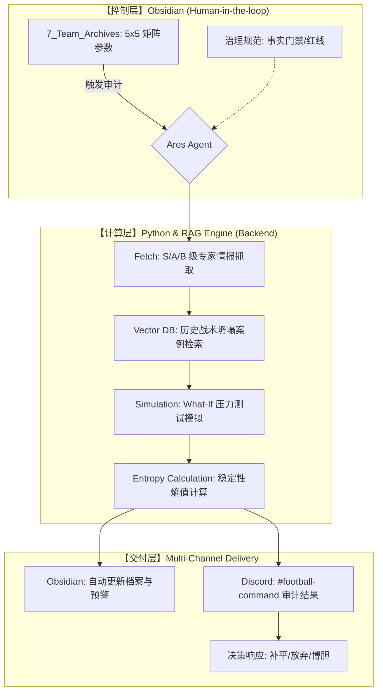

---
tags:
  - area/football-matrix
  - type/system
  - ares/architecture
  - tactical-rag
  - dynamic-simulation
status: evergreen
version: 4.0
creation_date: 2026-04-12
last_modified_date: 2026-04-15
related_area: "[[领域 - 竞彩架构与数据分析]]"
---

# 体系 - Ares Football 深度分析与 RAG 对冲系统 v4.0

> [!tip] 系统定位：动态熵增与市场解耦架构
本系统已从“静态证据搜集”升维为“动态系统模拟”。核心目标是利用 RAG 库执行“压力测试”，识别球队在逆境下的“战术坍塌”风险，从而捕捉市场共识与真实鲁棒性之间的非对称机会。

## 1. 核心理念：从“形态”转向“重建”
战术不应被视为静态的阵型，而是一个动态过程。其真实价值在于被对手干扰或陷入逆境后的**重建能力 (Capacity for Reconstruction)**。无重建评估，不博胆。

## 2. 动态审计全链路架构 (Mermaid) ^mermaid

    
    
## 3. v4.0 核心分析引擎：动态压力模拟

系统不再追求“谁更强”，而是通过以下三个维度进行“压力测试”：

### 3.1 战术稳定性熵值 (Tactical Entropy S)

利用复杂网络理论，量化球队交互网络的鲁棒性。

- **计算逻辑**：若核心节点（如核心后腰）被封锁或伤停，系统自动计算整体熵值的增幅。
    
- **预警阈值**：$S > 0.7$ 时，强制触发“体系崩坏”预警。
    

### 3.2 逆境重建评分 (Rec-Rating)

专门衡量球队在落后、红牌或战术受阻时的有序度维持能力。

- **S 级证据**：强制检索 RAG 库中关于“先丢球”、“多打少失败”或“久攻不下”的历史战术复盘文本。
    

### 3.3 What-If 压力模拟器

赛前强制执行三个极端情景模拟：

1. **核心坍塌**：关键球员 A 缺阵或被针对性限制后的表现。
    
2. **临场高压**：面对 $H (High-Press)$ 强度的连续冲击，防线 $Line Height$ 的退化趋势。
    
3. **决策异化**：高压环境下球员决策成功率的预期降幅（参考 Transformer 多模态模型数据）。
    

## 4. 5x5 标准化矩阵 (输入标尺)

详见：[[规范 - Ares 战术 5x5 矩阵标准化取值规范 v1.0]]

- **维度**：进攻发起 (P)、空间利用 (W/C)、转换速率 (F/S)、防守高度 (H/M/L)、定位球 (A/V)。
    
- **作用**：为 v4.0 模拟器提供初始参数输入。
    

## 5. 市场解耦逻辑 (Decoupling)

- **原理**：机构当前的 Hold 率优化策略往往利用大众的“归纳法偏见”。
    
- **动作**：若市场情绪（热度）与 v4.0 压力测试结果（鲁棒性）出现非对称偏离，直接标记为 **EV+ (超额价值)**。
    

## 6. 事实门禁与执行红线

- **Truth > Completeness**：若 RAG 库缺乏逆境样本，强制停机并输出 `Unknown`。
    
- **时效性**：S 级战术分析超过 21 天未更新，自动降权战术维度可信度。
    

## 7. 关联文档

- **执行手册**：[[SOP - Ares v4.0 Agent 指令集规范]]
    
- **资产索引**：[[MOC - 五大联赛球队索引|7_Team_Archives/五大联赛球队索引]]
    
- **治理规范**：[[规范 - Ares Review 事实门禁与未知结果停机规则 v1]]
    
